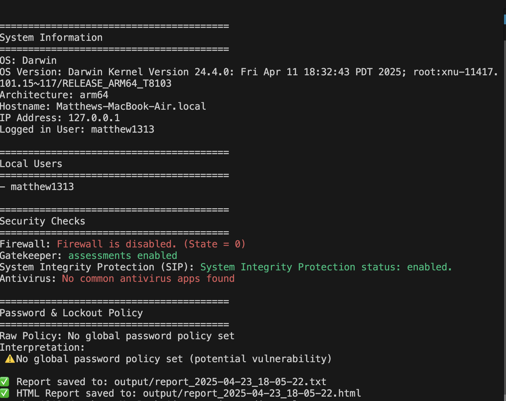
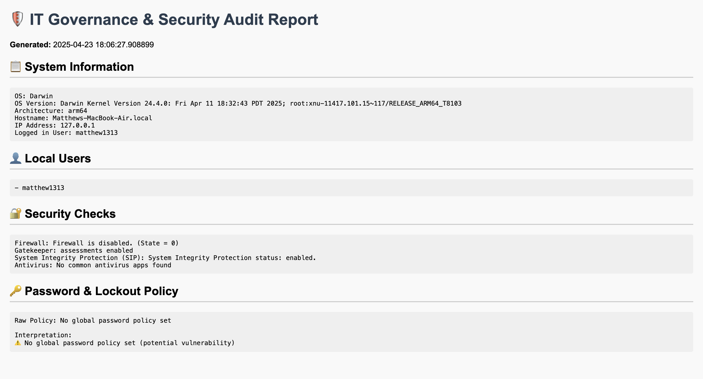

# IT Governance & Security Audit Tool

This is a lightweight Python-based security audit tool designed for macOS systems. It scans system-level configurations, including OS details, user accounts, firewall settings, password policies, and more. It also outputs a professional-grade audit report in both `.txt` and `.html` formats.

This tool is designed for:
- System administrators
- Security students
- Auditors
- Anyone wanting a quick assessment of their macOS system's security posture

## Screenshots

### Terminal Output


### HTML Report View


## Features

- Detects OS version, architecture, hostname, and logged-in user
- Lists all local user accounts
- Checks firewall, Gatekeeper, and SIP status
- Detects presence of common antivirus software
- Analyzes password and lockout policy settings
- Color-coded terminal output for quick visibility
- Generates both `.txt` and `.html` reports


## How to Run

Clone the repo, install dependencies, and run the audit tool:

```bash
git clone https://github.com/YOUR_USERNAME/security-audit-tool.git
cd security-audit-tool
python3 -m venv venv
source venv/bin/activate
pip install -r requirements.txt
python3 main.py
```


---

### ✅ After this:
- Preview the README to confirm formatting
- Replace `YOUR_USERNAME` when you upload the repo
- You’re fully GitHub-ready
  
